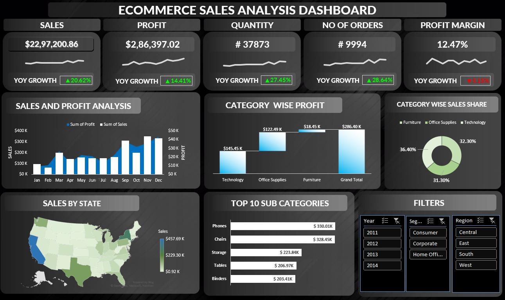

# E-Commerce Sales Analysis

## Tools Used
Excel | Power BI | Data Analysis | Data Visualization

## Key Insights
• Analyzed $2.29M revenue and $286K profit  
• Evaluated 37,873 units across 9,994 orders  
• Identified high-margin product categories and regional trends

## Dashboard

